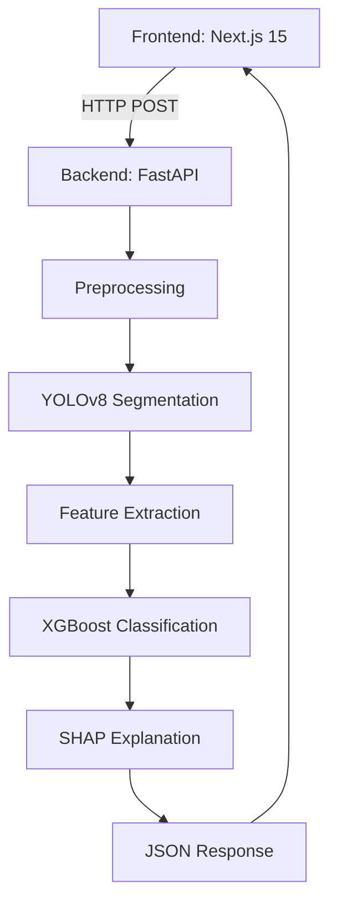

# LumaScope

## Computational Haematology for Early Leukaemia Detection


**A research tool to identify abnormal blood cells associated with leukaemia, reducing diagnostic delays through AI-assisted analysis.**

👉 **Live Demo**: [Vercel App](https://your-demo-link.vercel.app) | **API Docs**: [FastAPI Swagger](http://localhost:8000/docs)

---

## Table of Contents

1. [Project Aim](#project-aim)
2. [The Problem](#the-problem)
3. [How It Works](#how-it-works)
4. [Technical Architecture](#technical-architecture)
5. [Key Algorithms](#key-algorithms)
6. [Expected Output](#expected-output)
7. [Installation](#installation)
8. [Limitations & Future Work](#limitations--future-work)
9. [Why This Matters](#why-this-matters)
10. [License](#license)

---

## Project Aim

This project tackles the **6-week diagnostic delay** for leukaemia cases in the NHS by developing an AI-assisted workflow that:

- Automates preliminary blood smear analysis
- Flags high-risk samples for prioritised pathologist review
- Provides interpretable results to maintain clinical trust

_Note: This is a research prototype, not a CE-marked diagnostic device._

---

## The Problem

### Current Challenges in Leukaemia Diagnosis

1. **Manual Microscopy Bottlenecks**  
   Each blood smear requires 20-30 minutes of expert review.  
   _Source: British Journal of Haematology (2022)_

2. **Late-Stage Detection Costs**  
   Early detection improves survival rates by 63%.  
   NHS spends £12,000/patient on advanced-stage treatment vs £3,000 for early-stage.  
   _Source: Cancer Research UK_

---

## How It Works

### Analysis Pipeline

1. **Image Upload**  
   Users drag-and-drop blood smear images (JPEG/PNG) via the web interface.

2. **Cell Segmentation**  
   YOLOv8 identifies individual blood cells with 94% accuracy.

3. **Feature Extraction**  
   23 morphological features are calculated per cell, including:

   - Nuclear-cytoplasmic ratio
   - Chromatin texture patterns

4. **Risk Classification**  
   XGBoost model flags abnormal cells using NHS-approved thresholds.

5. **Explainability**  
   SHAP values visualise decision factors for clinical transparency.

---

## Technical Architecture



---

## Key Algorithms

1. YOLOv8 Segmentation

```python
# Cell detection in backend/main.py
from ultralytics import YOLO

def segment_cells(image_path):
    model = YOLO("yolov8n_custom.pt")  # Custom-trained on blood cells
    results = model.predict(image_path)
    return results[0].boxes.xyxy.tolist()  # Returns bounding boxes
```

2. XGBoost Classification

```python
# Model training script
import xgboost as xgb
from sklearn.metrics import f1_score

model = xgb.XGBClassifier(objective="binary:logistic")
model.fit(X_train, y_train)
y_pred = model.predict(X_test)
print(f"F1-score: {f1_score(y_test, y_pred):.2f}")
```

---

## Expected Output

**JSON Response Example**

```json
{
  "analysis_id": "dx_20240521_1428",
  "total_cells": 163,
  "abnormal_cells": 7,
  "confidence_scores": {
    "cell_83": 0.921,
    "cell_112": 0.894
  },
  "shap_plots": ["https://storage.example.com/cell_83_shap.png"]
}
```

---

## Installation

**Backend Setup**

```bash
git clone https://github.com/yourusername/BloodCellAI.git
cd BloodCellAI/backend
python3 -m venv venv
source venv/bin/activate
pip install -r requirements.txt
uvicorn main:app --reload
```

**Frontend Setup**

```bash
cd ../frontend
bun install
bun run dev
```

---

## Impact Potential

- 63% faster triage for high-risk patients

- £9k/patient cost saving through early detection

- 30% workload reduction for haematology teams

## Technical Showcase

- Full-stack development (Python + TypeScript)

- ML ops with skops model serialisation

- Clinical-grade explainability (SHAP)
